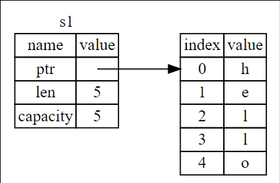
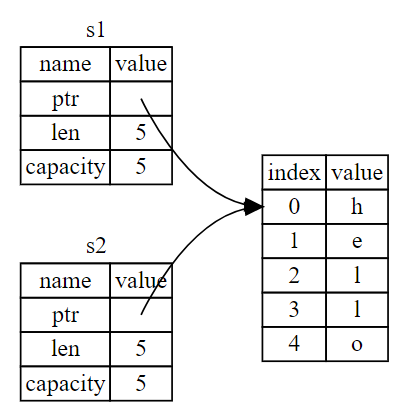
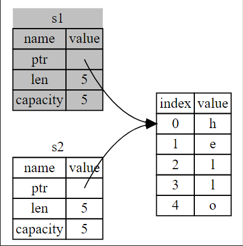

# Ownership

Ownership is Rust’s most unique feature, and it enables Rust to make memory safety guarantees without needing a garbage collector.

## What is Ownership?

Rust’s central feature is *ownership*. Memory is managed through a system of ownership with a set of rules that the compiler checks at compile time.

>   ### [The Stack and the Heap](https://doc.rust-lang.org/book/ch04-01-what-is-ownership.html#the-stack-and-the-heap)

## Ownership Rules

-   Each value in Rust has a variable that’s called its *owner*.
-   There can only be one owner at a time.
-   When the owner goes out of scope, the value will be dropped.

### Variable Scope

A scope is the range within a program for which an item is valid.

-   When a `variable` comes *into scope*, it is valid.
-   It remains valid until it goes *out of scope*.

### The String Type

The string literal types covered previously are all stored on the stack and popped off the stack when their scope is over

String literals are convenient, but they aren’t suitable for every situation.

1.  They’re immutable. 
2.  Not every string value is known when code is written: for example, taking user input and storing it. 

For these situations, Rust has a second string type, `String`, which is allocated on the heap and is able to store text that is unknown when compiling.

```rust
let s = String::from("hello");
```
> _The double colon (`::`) is an operator that allows us to namespace this 	particular `from`._
>
> _It is used to call associated functions from static items, and thus the output from the items will always be the same, asides from the parameters._

This kind of string *can* be mutated.

The difference between `String` and literals is how the two types deal with memory.

### Memory and Allocation

In the case of a string literal, we know the contents at compile time, so the text is hardcoded directly into the final executable. This is why string literals are fast and efficient.

In order to store a mutable, growable piece of text for a `String` type, an amount of memory is allocated on the heap that is unknown at compile time. 

-   This means the memory must be requested from the operating system at runtime, and there needs to be a way to return this memory to the operating system after its usage.

In Rust, the memory is automatically returned once the variable that owns it goes out of scope.

```rust
fn main() {
	let s = String::from("hello"); // s is valid from this point forward
	// do stuff with s
}                                 // this scope is now over, and s is no longer valid
```

### Ways Variables and Data Interact: Move

```rust
let s1 = String::from("hello");
let s2 = s1;
```

A `String` is made up of three parts, shown on the left of the diagram: 

1.  A pointer to the memory that holds the contents of the string
2.  A length (how much memory, in bytes, the contents of the `String` is currently using)
3.  A capacity (total amount of memory, in bytes, that the `String` has received from the operating system.)

This group of data is stored on the stack. On the right is the memory on the heap that holds the contents.



When we assign `s1` to `s2`, the `String` data is copied, meaning we copy the pointer, the length, and the capacity that are on the stack. We do not copy the data on the heap that the pointer refers to.



Essentially, `s1` and `s2` both point to the **same** data on the heap.

Instead of trying to copy the allocated memory, Rust considers `s1` to no longer be valid and, therefore, Rust doesn’t need to free anything when `s1` goes out of scope. Check out what happens when you try to use `s1` after `s2` is created; it won’t work:

```rust
let s1 = String::from("hello");
let s2 = s1;

println!("{}, world!", s1);
// This code won't compile because Rust prevents you from using the invalidated reference. 
```

Because Rust invalidates the first variable, this is known as a *move*. In this example, we would say that `s1` was *moved* into `s2`. What actually happens is shown here: 



>   _Rust will never automatically create “deep” copies of your data (copying of heap data instead of just pointer). Any **automatic** copying by Rust can be assumed to be inexpensive in terms of runtime performance._

### Ways Variables and Data Interact: Clone

If we *do* want to deeply copy the heap data of the `String`, not just the stack data, we can use a common method called `clone`.

```rust
let s1 = String::from("hello");
let s2 = s1.clonea();
println!("s1 = {}, s2 = {}", s1, s2);
```
*   When `clone` is called, it can be assumed that arbitrary, expensive code. 
*   It’s a visual indicator that something different is going on.

### Stack-Only Data: Copy

This code using integers works, but seems to contradict the principles stated previously: there's no call to `clone`, but `x` is still valid and wasn’t moved into `y`.

```rust
let x = 5;
let y = x;
println!("x = {}, y = {}", x, y);
```
This is because the size of types such as integers are known at compile time, and are stored entirely on the stack.

Because of this, copies of the actual values are quick to make. This means there’s no reason to prevent `x` from being valid after creating the variable `y`

Rust has a special annotation called the `Copy` trait that is placed on types (like integers) that are stored on the stack. If a type has the `Copy` trait, an older variable is still usable after assignment. Rust won’t let us annotate a type with the `Copy` trait if the type, or any of its parts, has implemented the `Drop` trait. If the type needs something special to happen when the value goes out of scope and we add the `Copy` annotation to that type, we’ll get a compile-time error.

As a general rule, any group of simple scalar values can be `Copy`, and nothing that requires allocation or is some form of resource is `Copy`.

Here are some of the types that are `Copy`:

-   All the integer types, such as `u32`.
-   The Boolean type, `bool`, with values `true` and `false`.
-   All the floating point types, such as `f64`.
-   The character type, `char`.
-   Tuples, if they only contain types that are also `Copy`. For example, `(i32, i32)` is `Copy`, but `(i32, String)` is not.

### Ownership and Functions

The semantics for passing a value to a function are similar to those for assigning a value to a variable. Passing a variable to a function will move or cop,y just as assignment does.

```rust
fn main() {
    let s = String::from("hello");  // s comes into scope
    takes_ownership(s);             // s's value moves into the function...
                                    // ... and so is no longer valid here
    let x = 5;                      // x comes into scope
    makes_copy(x);                  // x would move into the function, but i32 is Copy, so it’s okay to still use x afterward
} // Here, x goes out of scope, then s. But because s's value was moved, nothing special happens.

fn takes_ownership(some_string: String) { // some_string comes into scope
    println!("{}", some_string);
} // Here, some_string goes out of scope and drop is called. The backing memory is freed.

fn makes_copy(some_integer: i32) { // some_integer comes into scope
    println!("{}", some_integer);
} // Here, some_integer goes out of scope. Nothing special happens.
```

### Return Values and Scope

Returning values can also transfer ownership.

```rust
fn main() {
    let s1 = gives_ownership();         // gives_ownership moves its return value into s1
    let s2 = String::from("hello");     // s2 comes into scope
    let s3 = takes_and_gives_back(s2);  // s2 is moved into takes_and_gives_back, which also moves its return value into s3
} // Here, s3 goes out of scope and is dropped. s2 goes out of scope but was moved, so nothing happens. s1 goes out of scope and is dropped.

fn gives_ownership() -> String {             // gives_ownership() will move its return value into the function that calls it
    let some_string = String::from("hello"); // some_string comes into scope
    some_string                              // some_string is returned and moves out to the calling function
}

// takes_and_gives_back will take a String and return one
fn takes_and_gives_back(a_string: String) -> String { // a_string comes into scope
    a_string  // a_string is returned and moves out to the calling function
}
```

The ownership of a variable follows the same pattern every time: assigning a value to another variable moves it. When a variable that includes data on the heap goes out of scope, the value will be cleaned up by drop unless the data has been moved to be owned by another variable.

