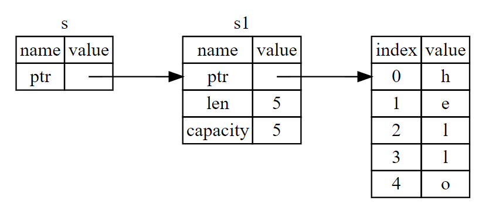

# References and Borrowing

## Main Rules (Summary)

-   At any given time, you can have *either* one mutable reference *or* any number of immutable references.
-   References must always be valid.

## Using References

Taking ownership and then returning ownership with every function is a bit tedious. What if we want to let a function use a value but not take ownership? It’s quite annoying that anything we pass in also needs to be passed back if we want to use it again, in addition to any data resulting from the body of the function that we might want to return as well.

It’s possible to return multiple values using a **tuple** (a collection of values of different `types`). 

```rust
fn main() {
    let s1 = String::from("hello");
    let (s2, len) = calculate_length(s1);
    println!("The length of '{}' is {}.", s2, len);
}

fn calculate_length(s: String) -> (String, usize)  {
    let length = s.len(); // len() returns the length of a String
    (s, length)
}
```

The issue with this code is that we have to return the `String` to the calling function so it can be used again to by the macro `println!`

However, it would be easier to do this using *references*.

```rust
fn main() {
    let s1 = String::from("hello");
    let len = calculate_length(&s1);
    println!("The length of '{}' is {}.", s1, len);
}

fn calculate_length(s: &String) -> usize { // s is a reference to a String
    s.len()
} // Here, s goes out of scope. But because it does not have ownership of what it refers to, nothing happens.
```

The ampersands (&) are *references*, which refer to a value without taking ownership of it.



>   _A diagram of `&String s` pointing at `String s1`_
>
>   _Note: The opposite of referencing by using `&` is *dereferencing*, which is accomplished with the dereference operator, `*`_

```rust
let s1 = String::from("hello");     
let len = calculate_length(&s1);
```

The `&s1` syntax creates a reference that *refers* to the value of `s1`, but does not own it, meaning the value it points to won't be dropped when the reference itself goes out of scope.

If a function has references as parameters, it won’t need to return the values to the original scope because it never took ownership of them.

Having references as function parameters is called *borrowing*.

However, references are immutable because you obviously can't edit something you don't own.

## Mutable References

```rust
fn main() {
    let mut s = String::from("Hello"); // Make s mutable
    change(&mut s);
}

fn change(some_string: &mut String) { // Must accept a mutable reference
    some_string.push_str(", world!");
}
```

Mutable references have one big restriction: you can have only one mutable reference to a particular piece of data in a particular scope.

The benefit this is that Rust can prevent data races, which happens when these three behaviors occur:

- Two or more pointers access the same data at the same time.
- At least one of the pointers is being used to write to the data.
- There’s no mechanism being used to synchronize access to the data.

Additionally, combining mutable and immutable references is prohibited.

```rust
let mut s = String::from("hello");
let r1 = &s; // No problem
let r2 = &s; // Multiple immutable references are fine because they only read data, can't affect any other reference's reading.
let r3 = &mut s; // Problem
println!("{}, {}, and {}", r1, r2, r3);
```

However, this code will compile because the last usage of the immutable references occurs before the mutable reference is introduced:

```rust
let mut s = String::from("hello");
let r1 = &s; // no problem
let r2 = &s; // no problem
println!("{} and {}", r1, r2); // r1 and r2 are no longer used after this point
let r3 = &mut s; // no problem
println!("{}", r3);
```

## Dangling References

In languages with pointers, a *dangling pointer* references a location in memory that is incorrect (unallocated or is allocated by the incorrect data).
These are created when memory is freed while preserving a pointer to that memory.
In Rust, by contrast, the compiler guarantees that references will never be dangling references: with references to data, the compiler will ensure that the data will not go out of scope before the reference to the data does.

Let’s try to create a dangling reference, which Rust will prevent with a compile-time error:

```rust
fn main() {
    let reference_to_nothing = dangle();
}

fn dangle() -> &String { // dangle returns a reference to a String
    let s = String::from("hello"); // s is a new String
    &s // we return a reference to the String, s
} // Here, s goes out of scope, and is dropped. Its memory goes away. Danger!

// This code would work. Ownership is moved out, and nothing is deallocated.
fn no_dangle() -> String {
    let s = String::from("hello");
    s // To avoid, simply don't return a reference
}
```

The error message:

```text
this function's return type contains a borrowed value, but there is no value for it to be borrowed from.
```

Because `s` is created inside `dangle`, when the code of `dangle` is finished, `s` will be deallocated. But we tried to return a reference to it. That means this reference would be pointing to an invalid `String`. That’s no good! 