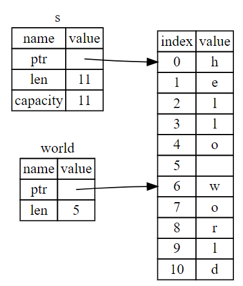

# The Slice Type

Another data type that doesn't have ownership is the *slice*. Slices reference a contiguous (one after the other) sequence of elements in a collection rather than the whole collection.

## String Slices

A *string slice* is a reference to part of a `String`.

```rust
let s = String::from("hello world");
let hello = &s[0..5];
let world = &s[6..11];
```




```rust
// You can drop the first or the last integer in the period to start at the beginning or end at the end
// These variables are equal
let slice = &s[0..len];
let slice = &s[..];
```

To find the first word in a string:

```rust
fn first_word(s: &String) -> &str {
    let bytes = s.as_bytes(); // convert string to an array of bytes

    for (i, &item) in bytes.iter().enumerate() { // i is the index in the tuple and &item is the byte in the tuple
        if item == b' ' { // check if the character is a space
            return &s[0..i]; // return the slice of the beginning of the string to the first space
        }
    }

    &s[..]
}
```

### String Literals Are Slices

```rust
let s = "Hello, world!";
```

 `s` is a `&str`: it’s a slice pointing to that specific point of the binary. This is also why string literals are immutable; `&str` is an immutable reference.

### String Slices as Parameters

For the `first_word` function, we gave the parameter the type `&String`

```rust
fn first_word(s: &String) -> &str {
```

An improvement would be: 

```rust
fn first_word(s: &str) -> &str {
```

Defining a function to take a string slice instead of a reference to a `String` makes our API more general and useful without losing any functionality:

```rust
let my_string = String::from("hello world");
let word = first_word(&my_string[..]); // works on slices of Strings
let my_string_literal = "hello world";
let word = first_word(&my_string_literal[..]); // works on slices of string literals
let word = first_word(my_string_literal); //  string literals *are* string slices already, so this works too
```

## Other Slices

String slices, as you might imagine, are specific to strings. But there’s a more general slice type, too. Consider this array:

```rust
let a = [1, 2, 3, 4, 5]; let slice = &a[1..3];
```

This slice has the type `&[i32]`. It works the same way as string slices do, by storing a reference to the first element and a length.

