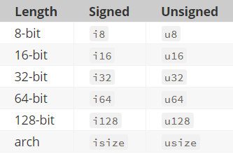

## Variables and Mutability

Variables are denoted by the syntax

```rust
let x = 5
```

Variables are immutable by default, and made mutable via ```mut```:

```rust
let mut x = 5
x = 6
```

Variables can also be **shadowed**

```rust
let x = 5;
let x = x + 1;
let x = x * 2;
```

Constants are type annotated variables declared with ```const```

* Usually declared in global scope

* Useful for values in the domain of the application that multiple parts of the program might need to know about.

    ```rust
    const MAX_POINTS: u32 = 100_000;
    ```

## Data Types

Rust is a *statically typed* language, which means that it must know the types of all variables at compile time. 

To convert a ```String``` to a number, use ```.parse()``` 

### Scalar Types

A *scalar* type represents a single value. 

Rust has four primary scalar types: integers, floating-point numbers, Booleans, and characters.

### Integer Types



*Signed* and *unsigned* refer to whether it’s possible for the number to be negative or positive

*   Signed: Positive and negative integers
*   Unsigned: Only positive integers

If unsure which to use, use `i32` (default integer type of Rust): this type is generally the fastest, even on 64-bit systems. 

### Floating-Point Types

