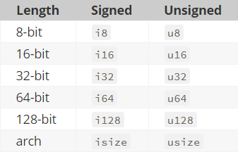

# 3.1 - Variables & Data Types

## Variables and Mutability

Variables are denoted by the syntax

```rust
let x = 5
```

Variables are immutable by default, and made mutable via ```mut```:

```rust
let mut x = 5
x = 6
```

Variables can also be **shadowed**

```rust
let x = 5;
let x = x + 1;
let x = x * 2;
```

Constants are type annotated variables declared with ```const```

* Usually declared in global scope

* Useful for values in the domain of the application that multiple parts of the program might need to know about.

    ```rust
    const MAX_POINTS: u32 = 100_000;
    ```

## Data Types

Rust is a *statically typed* language, which means that it must know the types of all variables at compile time. 

To convert a ```String``` to a number, use ```.parse()``` 

### Scalar Types

A *scalar* type represents a single value. 

Rust has four primary scalar types: integers, floating-point numbers, Booleans, and characters.

#### Integers



*Signed* and *unsigned* refer to whether it’s possible for the number to be negative or positive

*   Signed: Positive and negative integers
*   Unsigned: Only positive integers

If unsure which to use, use `i32` (default integer type of Rust): this type is generally the fastest, even on 64-bit systems. 

#### Floating-Points

Rust’s floating-point types are `f32` and `f64` 

Default is `f64`, as its essentially the same speed as `f32`.

#### Numeric Operations

```rust
let sum = 5 + 10; // addition
let difference = 95.5 - 4.3; // subtraction    
let product = 4 * 30; // multiplication
let quotient = 56.7 / 32.2; // division
let remainder = 43 % 5; // remainder
```

#### Bools

```rust
let t = true;
let f: bool = false; // with explicit type annotation
```

#### Chars

```rust
let c = 'c'
```

### Compound Types

Groups multiple values into one type. Rust has two primitive compound types: tuples and arrays.

### Tuples

A tuple is a general way of grouping together a number of values with a variety of types into one compound type. Tuples have a fixed length: once declared, they cannot grow or shrink in size.

```rust
fn main() {
    let tuple: (i32, f64, u8) = (50, 6.4, 1); // Optional type annotation
    
    let (x, y, z) = tuple; // Pattern match to destructure
    
    // Access direct elements
    let var_one = tuple.0;
    let var_two = tuple.1;
    let var_three = tuple.2;
    
    println!("The value of y is: {}", y);
}
```

### Arrays

*   Every element must have the same type. 
*   Arrays in Rust have a fixed length, like tuples.

```rust
let a = [1, 2, 3, 4, 5];

let a: [i32; 5] = [1, 2, 3, 4, 5]; // i32:  type of each element
								   // 5: array contains 5 elements

let a = [3; 5]; // contains 5 elements that will all be 3
				// same as let a = [3, 3, 3, 3, 3];
```

Access with `array[index]`

**Vector**: a similar collection type provided by the standard library that *is* allowed to grow or shrink in size. 

If you’re unsure whether to use an array or a vector, you should probably use a vector. Chapter 8 discusses vectors in more detail.